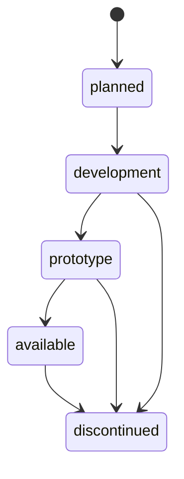

# Product Lifecycle

Every FreClean product carries exactly one `lifecycleStatus`, enforced by `schema/product.schema.json`.

| Status | Meaning | Can claim "commercially available"? |
|---|---|---|
| `planned` | Intended for the future, not started | No |
| `development` | Formulation or design in progress | No |
| `prototype` | A working sample exists, not yet sold | No |
| `available` | Verified in stock and sold to customers | Yes, but only after `validate-catalog.ts` confirms a real SKU and `manufacturingStatus: in_production` |
| `discontinued` | No longer produced or sold | No |

## Why validation is enforced in CI, not just by convention

`validate-catalog.ts` fails the build if any product is marked `available` without a real SKU and an `in_production` manufacturing status. This is the mechanical version of FreClean's realism rule (see `freclean-docs`): it is not possible to accidentally ship a catalog entry that claims a product is for sale before that is actually true.
